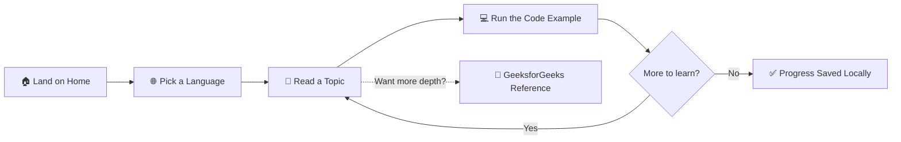

<table width="100%">
<tr>
<td width="15%" align="center">

</td>
<td width="70%" align="center">

</td>
<td width="15%" align="center">

</td>
</tr>
</table>

<div align="center">

<h3>Learn Programming, The Easy Way</h3>


<br/>

<a href="https://shahrishabh1513-jsk.github.io/RT_Syntaxlab/"></a>
<a href="https://github.com/shahrishabh1513-jsk/RT_Syntaxlab"></a>
<a href="https://github.com/shahrishabh1513-jsk/RT_Syntaxlab/stargazers"></a>

<br/><br/>


<br/>


</div>

<br/>

<table align="center">
<tr>
<td align="center" width="25%"><sub>LANGUAGES</sub><br><b>9+</b></td>
<td align="center" width="25%"><sub>TOPICS COVERED</sub><br><b>150+</b></td>
<td align="center" width="25%"><sub>CODE EXAMPLES</sub><br><b>200+</b></td>
<td align="center" width="25%"><sub>PRICE</sub><br><b>100% Free</b></td>
</tr>
</table>

<div align="center">

[](#-live-preview)
[](#-about-the-project)
[](#-key-features)
[](#-site-map)
[](#-how-it-works)
[](#️-tech-stack)
[](#-folder-structure)
[](#-getting-started)
[](#-connect)

</div>

<div align="center"></div>

## 🔍 Live Preview

<div align="center">

<a href="https://shahrishabh1513-jsk.github.io/RT_Syntaxlab/" target="_blank">

</a>

<sub>👆 Click to explore the live site</sub>

<br/><br/>

<a href="https://shahrishabh1513-jsk.github.io/RT_Syntaxlab/" target="_blank">
  
</a>

</div>

> 💡 First-load screenshots can occasionally appear blank before the screenshot cache warms up — refresh once if that happens; it self-corrects within a minute.

<div align="center"></div>

## 📖 About The Project

**RT_SyntaxLab** is a clean, distraction-free tutorial hub for learning programming — covering **HTML, CSS, JavaScript, Python, Java, PHP, C, C++, and SQL** with clear explanations, runnable code examples, and per-language progress tracking, all in one lightweight site.

It was built to be the opposite of a bloated learning platform: no accounts, no paywalls, no clutter — just bite-sized topics you can actually finish, with a real code sample and output for each one.

> 💬 *"Learn Programming, The Easy Way."*

<div align="center">

| | |
|---|---|
| 📚 **Type** | Multi-language programming tutorial hub |
| 🎯 **Built For** | Beginners who want clear, focused lessons |
| 🌐 **Languages Covered** | HTML · CSS · JavaScript · Python · Java · PHP · C · C++ · SQL |
| 📈 **Standout Feature** | Per-language progress tracking, saved in your browser |
| 🔗 **Extras** | Every topic links to a deeper GeeksforGeeks reference |

</div>

<div align="center"></div>

## ✨ Key Features

<table>
<tr>
<td width="50%" valign="top">

### 📖 Bite-Sized Topics
- 🧩 Every language broken into short, focused topics
- ⏱️ Finish a topic in minutes, not hours
- 🗂️ 150+ topics across 9 languages
- 🧭 Clear navigation between related concepts

</td>
<td width="50%" valign="top">

### 💻 Real Code Examples
- ▶️ 200+ runnable, copy-ready code snippets
- 📤 Sample output shown alongside every example
- 🎨 Syntax-highlighted code blocks
- 🧪 Learn by seeing real results, not just theory

</td>
</tr>
<tr>
<td width="50%" valign="top">

### 📈 Live Progress Tracking
- 💾 Progress saved per-language, right in your browser
- ↩️ Pick up exactly where you left off
- ✅ Visual completion status per topic
- 🔒 No account required

</td>
<td width="50%" valign="top">

### 🔗 Deeper References
- 📚 Every page links to a full GeeksforGeeks tutorial
- 🎯 Perfect for quick learning + deep-dive practice
- 🆓 100% free, forever
- 📱 Fully responsive, learn on any device

</td>
</tr>
</table>

<div align="center"></div>

## 🗺️ Site Map

<div align="center">

| Page | Description |
|:---:|---|
| 🏠 **Home** (`index.html`) | Language grid, stats & "Why RT_SyntaxLab" section |
| 🌐 **HTML** (`html.html`) | Semantic markup topics & examples |
| 🎨 **CSS** (`css.html`) | Styling, layout & design topics |
| 🐍 **Python** (`python.html`) | Simple, readable Python fundamentals |
| ⚡ **JavaScript** (`javascript.html`) | Browser interactivity & logic |
| ☕ **Java** (`java.html`) | Object-oriented, "write once run anywhere" |
| 🐘 **PHP** (`php.html`) | Server-side scripting for dynamic sites |
| 🅲 **C** (`c.html`) | Memory & system-level programming |
| ➕ **C++** (`cpp.html`) | Object-oriented programming with performance |
| 🗄️ **SQL** (`sql.html`) | Query, manage & analyze relational data |

</div>

<div align="center"></div>

## 🧭 How It Works



<div align="center"></div>

## 🛠️ Tech Stack

<div align="center">

| Category | Technology | Purpose |
|:---:|:---:|:---|
| **Markup** |  | Semantic page structure |
| **Styling** |  | Clean, light-themed responsive layouts |
| **Interactivity** |  | Progress tracking, navigation & interactions |
| **Storage** |  | Per-language progress, no backend |
| **Version Control** |   | Source control |
| **Deployment** |  | Live hosting |

</div>

<div align="center"></div>

## 📂 Folder Structure

<details>
<summary><b>Click to expand the folder structure 📁</b></summary>

```bash
RT_Syntaxlab/
│
├── index.html                # Home page
├── html.html                   # HTML tutorial track
├── css.html                      # CSS tutorial track
├── javascript.html                 # JavaScript tutorial track
├── python.html                       # Python tutorial track
├── java.html                           # Java tutorial track
├── php.html                              # PHP tutorial track
├── c.html                                  # C tutorial track
├── cpp.html                                  # C++ tutorial track
├── sql.html                                    # SQL tutorial track
│
├── logo.svg                                      # RT_SyntaxLab logo
│
├── css/
│   └── style.css                                     # Global styles
│
├── js/
│   ├── progress.js                                       # Per-language progress tracking
│   └── main.js                                               # Shared navigation & interactions
│
└── README.md                                                     # Project documentation
```

</details>

<div align="center"></div>

## 🚀 Getting Started

### Option 1 — Use the live version

No setup needed 👉 **[Open RT_SyntaxLab](https://shahrishabh1513-jsk.github.io/RT_Syntaxlab/)**

### Option 2 — Run it locally

```bash
# 1️⃣ Clone the repository
git clone https://github.com/shahrishabh1513-jsk/RT_Syntaxlab.git

# 2️⃣ Navigate into the project directory
cd RT_Syntaxlab

# 3️⃣ Open index.html in your browser
#    (or use the Live Server extension in VS Code)
```

✅ No build tools, dependencies, or installations required — it's a pure **HTML/CSS/JS** project.

<div align="center"></div>

## 🧭 Roadmap

- [x] 9 language tracks with topic breakdowns
- [x] Runnable code examples with sample output
- [x] Per-language progress tracking (localStorage)
- [x] GeeksforGeeks deep-dive links per topic
- [ ] 🔍 Search across all topics
- [ ] 🧑‍💻 In-browser interactive code runner
- [ ] 🌙 Dark mode
- [ ] 🏆 Achievement badges for completed languages

<div align="center"></div>

## 🤝 Connect

<div align="center">

**Rishabh Alpeshabhai Shah**

<a href="https://rishabh-shah-portfolio.netlify.app/"></a>
<a href="https://www.linkedin.com/in/rishabh-alpeshabhai-shah-91b9072a6/"></a>
<a href="mailto:shahrishu1515@gmail.com"></a>
<a href="https://github.com/shahrishabh1513-jsk"></a>

</div>

---

<div align="center">

### ⭐ If this helped you learn something new, give it a star!


<br/>

**Made with 💻 & 💚 by Rishabh Shah**


</div>
